.. _model:

Modeling
========

This document describes the ``carculator_bus`` model, assumptions
and inventories as exhaustively as possible.

Overview of ``carculator_bus``
------------------------------

``carculator_bus`` is an open-source Python library. Its code is publicly
available via its `Github repository <https://github.com/romainsacchi/carculator_bus>`__.
You can also :download:`download an examples notebook <_static/resources/examples.zip>`, that guides new users into performing life cycle analyses.
The tool generates bus inventories for different powertrain types, size classes, and years of manufacture.

Vehicle modelling
-----------------

The modelling of vehicles along powertrain types, time and size classes
is described in this section. It is also referred to as *foreground*  modelling.

Powertrain types
****************

``carculator_bus`` can model the following powertrain types:

-  Diesel-run internal combustion engine vehicle (ICEV-d)
-  Gas-run internal combustion engine vehicle (ICEV-g)
-  Diesel-run hybrid electric vehicle (HEV-d)
-  Battery electric vehicle (BEV):
    * overnight charging at depot (BEV-depot)
    * opportunity charging (BEV-opp)
    * motion-charging (BEV-motion), also commonly referred to as trolleybuses
-  Fuel cell electric vehicle (FCEV)

Size classes
************

Several size classes are available for each powertrain type, as indicated in :ref:`Table 1 <table-1>`.
Some powertrain-size class combinations are not commercially available or technologically mature and
are therefore not considered.

.. _table-1:

.. table:: Table 1: Powertrain-size class combinations considered in this study
   :widths: auto
   :align: center

   +-----------------------------+------------+------------+-----------+----------+---------------+--------------+----------------+
   | **size/powertrains**        | **ICEV-d** | **ICEV-g** | **HEV-d** | **FCEV** | **BEV-depot** | **BEV-opp**  | **BEV-motion** |
   +=============================+============+============+===========+==========+===============+==============+================+
   | 9m (midibus)                | x          | x          | x         | Only for 2020                           | Not available  |
   +-----------------------------+------------+------------+-----------+                                         +----------------+
   | 13m, single deck, city      | x          | x          | x         |                                         | Only for 2020  |
   +-----------------------------+------------+------------+-----------+----------+---------------+--------------+----------------+
   | 13m, single deck, coach     | x          | x          | x         | Not available                           | Not available  |
   +-----------------------------+------------+------------+-----------+----------+---------------+--------------+                +
   | 13m, double deck, city      | x          | x          | x         | Only for 2020                           |                |
   +-----------------------------+------------+------------+-----------+----------+---------------+--------------+                +
   | 13m, double deck, coach     | x          | x          | x         | Not available                           |                |
   +-----------------------------+------------+------------+-----------+----------+---------------+--------------+----------------+
   | 18m, articulated, city      | x          | x          | x         | Only for 2020                                            |
   +-----------------------------+------------+------------+-----------+----------+---------------+--------------+----------------+

|br|

.. image:: /_static/img/image_1.png
    :width: 45%

.. image:: /_static/img/image_2.png
    :width: 45%

|s_caption| *Example of a midibus, 9m and a single deck, city bus, 13m* |e_caption|

.. image:: /_static/img/image_3.png
    :width: 40%

.. image:: /_static/img/image_4.png
    :width: 50%

|s_caption| *Example of a double deck, city bus, 13m and a single deck, coach bus, 13m* |e_caption|

.. image:: /_static/img/image_5.png
    :width: 50%

.. image:: /_static/img/image_6.png
    :width: 45%

|s_caption| *Example of double deck, coach bus, 13m and a single-deck city bus, 18m* |e_caption|

Manufacture year and emission standard
**************************************

For ICE vehicles, several emission standards are considered. For
simplicity, it is assumed that the vehicle manufacture year corresponds
to the registration year, as indicated in :ref:`Table 2 <table-2>`.

.. _table-2:

.. table:: Table 2: Emission standards and year of manufacture for medium and heavy/duty trucks
   :widths: auto
   :align: center

   +------------+-----------------+-----------------+-----------------+
   |            | **Start of      | **End of        | **Manufacture   |
   |            | registration**  | registration    | year in this    |
   |            |                 | (incl.)**       | study**         |
   +============+=================+=================+=================+
   | **EURO-3** | 2000            | 2004            | **2002**        |
   +------------+-----------------+-----------------+-----------------+
   | **EURO-4** | 2005            | 2007            | **2006**        |
   +------------+-----------------+-----------------+-----------------+
   | **EURO-5** | 2008            | 2012            | **2010**        |
   +------------+-----------------+-----------------+-----------------+
   | **EURO-6** | 2013            |                 | **2020**        |
   +------------+-----------------+-----------------+-----------------+

.. _modelling-considerations-applicable-to-all-vehicle-types-1:

Modelling considerations applicable to all vehicle types
--------------------------------------------------------

.. _sizing-of-the-base-frame-1:

Sizing of the base frame
************************

The sizing of the base frame is mainly based on p. 17-19 of :cite:`ct-1040`.
Detailed weight composition is obtained for a **Midibus, 12t** and a
**Single deck, coach, 19t**. Curb mass is obtained for all
size classes. The rest being adjusted function of the gross mass, as indicated in :ref:`Table 3 <table-3>`.
These bus models correspond to the baseline year of 2010. A 2% light weighting
factor, as shown in the same report, is applied to represent the industry’s efforts in reducing
vehicle weight in 2020.

The following components are common to all powertrains:

-  Frame
-  Suspension
-  Brakes
-  Wheels and tires,
-  Electrical system
-  Transmission
-  Other components

.. _table-3:

.. table:: Table 3: Mass of urban bus and coach systems and components
   :widths: auto
   :align: center

   +---------------------------+----------------------+---------------------------+--------------------------------+--------------------------------+--------------------------------+-----------------------------+-----------------------------+
   |                           |                      | **Midibus, 12t**          | **Single deck, city bus, 19t** | **Single deck, city bus, 28t** | **Double deck, city bus, 26t** | **Single deck, coach, 19t** | **Double deck, coach, 26t** |
   +===========================+======================+===========================+================================+================================+================================+=============================+=============================+
   |                           | Type                 | rigid, 2 axles            | rigid, 2 axles                 | articulated, 3 axles           | rigid, 3 axles                 | rigid, 2 axles              | rigid, 3 axles              |
   +---------------------------+----------------------+---------------------------+--------------------------------+--------------------------------+--------------------------------+-----------------------------+-----------------------------+
   | in kilograms              | Gross weight         | 12'0000                   | 19'000                         | 28'000                         | 26'000                         | 19'000                      | 26'000                      |
   +---------------------------+----------------------+---------------------------+--------------------------------+--------------------------------+--------------------------------+-----------------------------+-----------------------------+
   | Powertrain                | Engine system        | 399                       | 931                            | 1'121                          | 1'121                          | 1'121                       | 1'200                       |
   +---------------------------+----------------------+---------------------------+--------------------------------+--------------------------------+--------------------------------+-----------------------------+-----------------------------+
   |                           | Coolant system       | 84                        | 116                            | 168                            | 130                            | 140                         | 182                         |
   +---------------------------+----------------------+---------------------------+--------------------------------+--------------------------------+--------------------------------+-----------------------------+-----------------------------+
   |                           | Fuel system          | 46                        | 66                             | 96                             | 74                             | 80                          | 104                         |
   +---------------------------+----------------------+---------------------------+--------------------------------+--------------------------------+--------------------------------+-----------------------------+-----------------------------+
   |                           | Exhaust system       | 60                        | 98                             | 142                            | 110                            | 118                         | 153                         |
   +---------------------------+----------------------+---------------------------+--------------------------------+--------------------------------+--------------------------------+-----------------------------+-----------------------------+
   |                           | Transmission system  | 451                       | 395                            | 571                            | 443                            | 476                         | 618                         |
   +---------------------------+----------------------+---------------------------+--------------------------------+--------------------------------+--------------------------------+-----------------------------+-----------------------------+
   | Electrical system         |                      | 135                       | 183                            | 264                            | 205                            | 220                         | 286                         |
   +---------------------------+----------------------+---------------------------+--------------------------------+--------------------------------+--------------------------------+-----------------------------+-----------------------------+
   | Chassis system            | Frame                | 472                       | 695                            | 1'004                          | 778                            | 837                         | 1'087                       |
   +---------------------------+----------------------+---------------------------+--------------------------------+--------------------------------+--------------------------------+-----------------------------+-----------------------------+
   |                           | Suspension           | 1'032                     | 1'490                          | 2'153                          | 1'669                          | 1'795                       | 2'331                       |
   +---------------------------+----------------------+---------------------------+--------------------------------+--------------------------------+--------------------------------+-----------------------------+-----------------------------+
   |                           | Braking system       | 149                       | 272                            | 393                            | 305                            | 328                         | 426                         |
   +---------------------------+----------------------+---------------------------+--------------------------------+--------------------------------+--------------------------------+-----------------------------+-----------------------------+
   |                           | Wheels and tires     | 245                       | 576                            | 832                            | 645                            | 694                         | 901                         |
   +---------------------------+----------------------+---------------------------+--------------------------------+--------------------------------+--------------------------------+-----------------------------+-----------------------------+
   | Cabin                     | Cabin                | 0                         | 0                              | 0                              | 0                              | 0                           | 0                           |
   +---------------------------+----------------------+---------------------------+--------------------------------+--------------------------------+--------------------------------+-----------------------------+-----------------------------+
   |                           | Body system          | 4'270                     | 5'570                          | 8'045                          | 6'238                          | 6'709                       | 8'714                       |
   +---------------------------+----------------------+---------------------------+--------------------------------+--------------------------------+--------------------------------+-----------------------------+-----------------------------+
   | Other                     |                      | 607                       | 858                            | 1'462                          | 882                            | 1'033                       | 1'598                       |
   +---------------------------+----------------------+---------------------------+--------------------------------+--------------------------------+--------------------------------+-----------------------------+-----------------------------+
   | Curb mass, incl. Trailer  |                      | 7'950                     | 11'250                         | 16'250                         | 12'600                         | 13'551                      | 17'600                      |
   +---------------------------+----------------------+---------------------------+--------------------------------+--------------------------------+--------------------------------+-----------------------------+-----------------------------+
   | Payload                   |                      | 4'050                     | 5'750                          | 9'750                          | 13'400                         | 5'450                       | 8'400                       |
   +---------------------------+----------------------+---------------------------+--------------------------------+--------------------------------+--------------------------------+-----------------------------+-----------------------------+

Other size-related parameters
*****************************

Passenger occupancy is essential, as environmental impacts are normalized to a
passenger-kilometer unit. The current version of Mobitool factors v.2.1 :cite:`ct-1004` uses
the following occupancy values:

* “City bus”: 10 passengers
* “Autocar” (coach): 21 passengers
* “Trolleybus” (18m): 19 passengers

Similar values are used for “Single deck, city bus, 13m”, “Single deck, coach, 13m” and
“Single deck, city bus, 18m” respectively. But the following occupancy values are also
inferred for the remaining size classes:

* Midibus, 9m: 5 passengers (based on a 16% load factor for “Single deck, city bus, 13m”)
* Double deck, city bus, 13m: 13 passengers (based on a 16% load factor for “Single deck, city bus, 13m”)
* Double deck, coach bus, 13m: 26 passengers (based on a 38% load factor for “Single deck, coach, 13m”)

Regarding the expected lifetime of the vehicles, the Swiss vehicles registry MOFIS from the
Swiss Federal Road Office :cite:`ct-1003` is used. Average lifetime values for
decommissioned buses in Switzerland are derived and presented in :ref:`Table 4 <table-4>`. Vehicles with
a lifetime below ten years or above 30 years are considered outliers and omitted. Because
the lifetime values obtained are very close to one another for all bus types but trolleybuses,
14 years is considered for those. For trolleybuses, the average value obtained is 21 years,
but the sample of decommissioned vehicles is small (3). However, all of them were
decommissioned at least after 20 years of use. Moreover, out of the 321 trolleybuses still in
operation in 2021, a third are already 14 years or older. Hence, a lifetime value of 20 years
seems representative.

.. _table-4:

.. table:: Table 4: Kilometric lifetime values for urban buses and coaches
   :widths: auto
   :align: center

   +---------------------------------------------+-------------------+------------------------+----------------------+-----------------------------+----------------+--------------------------------------+
   |                                             | **Midibus**       | **Single-decker, 13m** | **Articulated, 18m** | **Trolleybus (BEV-motion)** | **Source**     | **Comment**                          |
   +=============================================+===================+========================+======================+=============================+================+======================================+
   | Count                                       | 50                | 18                     | 316                  | 3                           | MOFIS vehicles | Outliers have been removed (with a   |
   |                                             |                   |                        |                      |                             | registry       | lifetime inferior to 10 years or     |
   |                                             |                   |                        |                      |                             | :cite:`ct-1003`| superior to 30 years)                |
   +---------------------------------------------+-------------------+------------------------+----------------------+-----------------------------+                +                                      +
   | Average lifetime [years]                    | 15.05             | 14.7                   | 14.2                 | 21                          |                |                                      |
   +---------------------------------------------+-------------------+------------------------+----------------------+-----------------------------+----------------+--------------------------------------+
   | Lifetime value used in this study [years]   | 14                | 14                     | 14                   | 20                          |                |                                      |
   +---------------------------------------------+-------------------+------------------------+----------------------+-----------------------------+----------------+--------------------------------------+

To estimate the annual mileage driven by the different bus types, the amount of vehicle-
kilometers driven by buses and trolleybuses is compared with the number of corresponding
vehicles in Switzerland for that same year, as provided by the Swiss Federal Statistical
Office :cite:`ct-1130`. The results of this comparison are shown in :ref:`Table 5 <table-5>`.

.. _table-5:

.. table:: Table 5: Annual mileage for buses and trolleybuses
   :widths: auto
   :align: center

   +---------------------------------+----------+-----------------------+-------------------+------------------------------+
   |                                 | **Year** | **Transport service** | **Vehicle stock** | **Annual mileage**           |
   |                                 |          | **[million vehicle**  | **[unit]**        | **[kilometer per year]**     |
   |                                 |          | **- kilometer]**      |                   |                              |
   +=================================+==========+=======================+===================+==============================+
   | Buses                           | 2005     | 229                   | 4'685             | 48'844                       |
   +                                 +----------+-----------------------+-------------------+------------------------------+
   |                                 | 2006     | 233                   | 4'586             | 50'775                       |
   +                                 +----------+-----------------------+-------------------+------------------------------+
   |                                 | 2007     | 230                   | 4'786             | 47'977                       |
   +                                 +----------+-----------------------+-------------------+------------------------------+
   |                                 | 2010     | 244                   | 4'871             | 50'092                       |
   +                                 +----------+-----------------------+-------------------+------------------------------+
   |                                 | 2015     | 272                   | 5'410             | 50'357                       |
   +---------------------------------+----------+-----------------------+-------------------+------------------------------+
   | Trolleybuses (BEV-motion)       | 2005     | 27                    | 606               | 44'490                       |
   +                                 +----------+-----------------------+-------------------+------------------------------+
   |                                 | 2006     | 27                    | 606               | 43'913                       |
   +                                 +----------+-----------------------+-------------------+------------------------------+
   |                                 | 2007     | 26                    | 596               | 43'216                       |
   +                                 +----------+-----------------------+-------------------+------------------------------+
   |                                 | 2010     | 27                    | 606               | 44'554                       |
   +                                 +----------+-----------------------+-------------------+------------------------------+
   |                                 | 2015     | 27                    | 548               | 49'507                       |
   +---------------------------------+----------+-----------------------+-------------------+------------------------------+

Based on this data, an annual mileage of 50’000 km is considered for all bus types.

Other size-related parameters are listed in :ref:`Table 6 <table-6>`. Some of them have
been obtained and/or calculated from manufacturers’ data, which is
available in :ref:`Annex C <annex-C>` of this report.

.. _table-6:

.. csv-table:: Table 6: Use and size parameters for urban buses and coaches.
    :file: _static/tables/table_1.csv
    :widths: auto
    :align: center
    :header-rows: 1

The number of axles influences several aspects of the bus's performance, notably its overall
rolling resistance and the emissions associated with tire, brake, and road wear. The rolling
resistance is calculated considering the number of axles, the relative load per axle, the
number of tires per axle, and the driving mass of the vehicle, as presented in the
documentation of VECTO :cite:`ct-1024`.

Auxiliary power demand
**********************
The auxiliary power demand comprises the base power demand, the power demand from
the battery management system, and the power demand from the HVAC system.

Base power demand
~~~~~~~~~~~~~~~~~

The auxiliary power base demand represents the power drawn from operating non-traction
equipment such as the air compressor, the ticket vending machines, trip information displays, the
steering compressor, etc. :cite:`ct-1104` estimate the base power load of a regular
13m-long single-decker. Considering the air compressor, the steering and braking systems, and
other devices, the instant base power load ranges between 2 and 7 kW (as not all devices work
simultaneously). :cite:`ct-1034` confirm the value of 7 kW, but only when all devices work
simultaneously. In the present study, a further assumption is made that such values for the base
power demand are probably correlated to the size of the vehicle, as well as to the type of use
(e.g., coach buses do not need to open and close doors as frequently as do urban buses).
Hence, the values presented in :ref:`Table 7 <table-7>`  are considered.

.. _table-7:

.. table:: Table 7: Non-exhaustive list of time-dependent parameters common to European trucks
   :widths: auto
   :align: center

   +---------------------------------+----------------------------+--------------------------------------+
   | Size class in this study        | **Power base demand [kW]** | **Source**                           |
   +=================================+============================+======================================+
   | Midibus, 9m                     | 2.25                       | From :cite:`ct-1104` estimates the   |
   |                                 |                            | base power load to be 2 to 7kW. It is|
   |                                 |                            | further scaled on the gross weight.  |
   +---------------------------------+----------------------------+                                      +
   | Single deck, city bus, 13m      | 5                          |                                      |
   | Double deck, city bus, 13m      |                            |                                      |
   | Single deck, city bus, 18m      |                            |                                      |
   +---------------------------------+----------------------------+                                      +
   | Single deck, coach, 13m         | 3.5                        |                                      |
   | Double deck, coach, 13m         |                            |                                      |
   +---------------------------------+----------------------------+--------------------------------------+

Battery management system power demand
~~~~~~~~~~~~~~~~~~~~~~~~~~~~~~~~~~~~~~

According to :cite:`ct-1034`, the battery management system requires 2.75 kW on hot
summer days to cool the battery down and 0.5 kW on cold winter days to keep it warm. The
average monthly daytime temperature for Switzerland is used (i.e., 12 values for the year)
together with the values mentioned above (i.e., 2.75 kW and 0.5 kW) to calculate the
additional load from the battery management system when the ambient temperature is
above 20 degrees Celsius and below 5 degrees Celsius, respectively.

HVAC power demand
*****************

Estimating heating and cooling needs is a complicated matter, and unfortunately, it is also
essential for BEV buses. In this study, a simplified approach is used. The following relation
between HVAC power draw and ambient temperature from :cite:`ct-1104` is
used, based on a 24 kW HVAC system fitted on a 12m city bus in Finland.

.. _figure-1:

.. figure:: _static/img/image_7.png
    :align: center

    *Figure 1: Relation between ambient outdoor temperature and HVAC system power output*

The HVAC system is sized according to the bus size class (i.e., from 10 kW for the midibus
to 24 kW for the double-deck or articulated buses). This curve is adapted to the different bus
size classes using the power load-to-maximum HVAC power ratio depicted above.

For BEV-buses, the HVAC is fitted with a heat pump, with the following Coefficients of
Performance (CoP), taken from :cite:`ct-1095`:

* CoP of 2.3 for heating
* CoP of 1.3 for cooling

For ICE buses, it is assumed that the excess heat from the engine is sufficient to warm the
passengers’ cabin to a comfortable temperature.

.. note::

    **Important assumption:** Although data cannot confirm this, coach buses likely have lower
    HVAC power requirements. They do not open doors as frequently and are generally better
    insulated (notably through double-glazed windows). Hence, coach buses are assumed to
    have an overall HVAC power requirement **20%** lower than city buses.

:ref:`Figure 2 <figure-2>` compares the different auxiliary energy components between a 13m single-deck
BEV and ICEV-d bus for city and intercity use, the outdoor ambient temperature function.

.. note::

    **Important remark:** the 13m single-deck BEV intercity bus (i.e., coach) is only shown for this
    purpose, as the model would not validate such a bus (at least, not in 2020, as the battery
    would make the bus heavier than its permitted gross mass when fully occupied).

.. _figure-2:

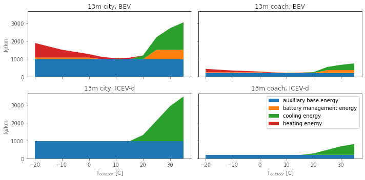

    *Figure 2: Auxiliary energy consumption as a function of outdoor ambient temperature*

Because the auxiliary energy depends on time and not on distance, it is more of an issue for
city buses when normalized per km, as they have an average speed of 2-to-3 times as low
as that of a coach bus.

However, buses do not constantly operate at -20°C or +30°C. This is why pre-set monthly
daylight average temperature series are used.

.. _figure-3:

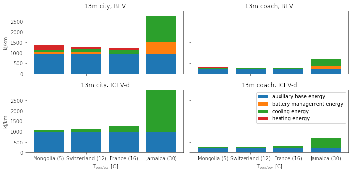

    *Figure 3: Auxiliary energy consumption for different countries, based on their yearly average daytime temperature*

But does this matter compared to the traction energy?

:ref:`Figure 4 <figure-4>` shows the energy consumption [1]_ of a 13m-long single-deck bus for urban and
intercity use, including the traction energy. The values are normalized to one vehicle-
kilometer as a function of the ambient temperature.

It seems that the power draw from the HVAC system can potentially be an issue, but
primarily for urban electric buses and, to a lesser extent, inter-city electric buses (provided
they are a viable option, which they are not currently). It seems auxiliary energy represents
25% of the tank-to-wheel energy consumption in normal conditions and goes up to 30% and
40% in very cold and hot conditions, respectively. This is as much energy not available for
traction purposes (i.e., which directly affects the vehicle’s range autonomy).

.. _figure-4:

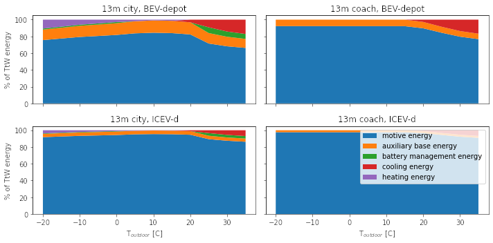

    *Figure 4: Distribution of the tank-to-wheel energy use for a single-deck 13m bus function of the ambient outdoor temperature*

-----

.. [1] The modeling of the traction energy is explained in the next section.

Abrasion emissions
******************

:ref:`Figure 5 <figure-5>` shows the calculated abrasion emissions for buses in mg per vehicle-kilometer,
following the approach presented in Section I.C.5.b.

.. _figure-5:

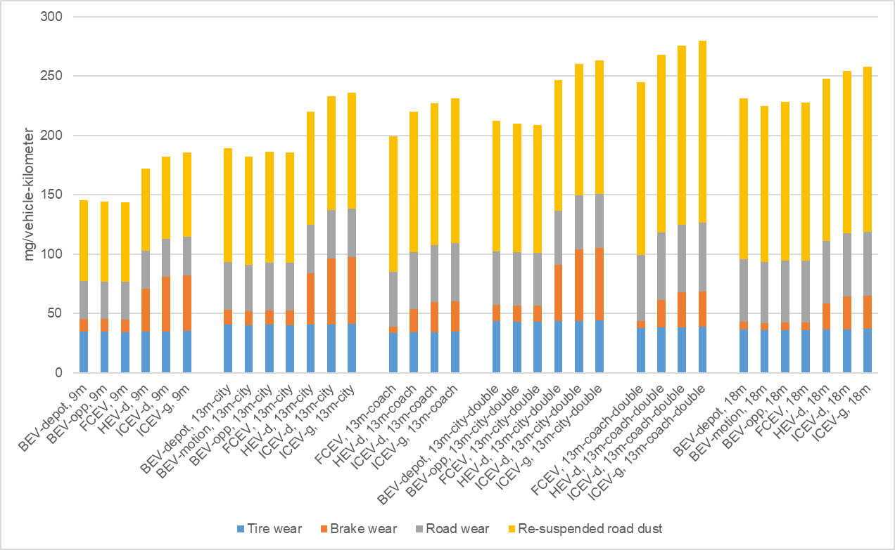

    *Figure 5: Total particulate matter emissions (<2.5 µm and 2.5-10 µm) in mg per vehicle-kilometer for buses.*

.. _modelling-approach-applicable-to-internal-combustion-engine-vehicles:

Modelling approach applicable to internal combustion engine vehicles
--------------------------------------------------------------------

.. _traction-energy:

Traction energy
***************

The traction energy for city buses is calculated based on the “Urban” driving cycle for buses
provided by VECTO :cite:`ct-1024`. Simulations in VECTO are run with
buses modeled as closely as possible to those of this study to obtain the performance along
the driving cycle (e.g., speed, friction losses, and fuel consumption, among others). :ref:`Figure 6 <figure-6>`
shows the first two hundred seconds of that driving cycle, distinguishing the target speed
from the actual speed managed by the different vehicles. The power-to-mass ratio influences
how much a vehicle manages to comply with the target speed.

.. _figure-6:

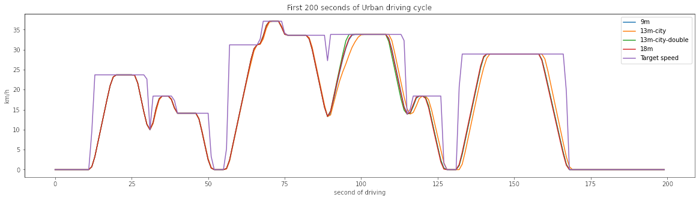

   *Figure 6: VECTO's Urban driving cycle (first two hundred seconds).*

Road gradients are also considered. :ref:`Figure 7 <figure-7>` shows the road gradient profile of the urban
driving cycle.

.. _figure-7:

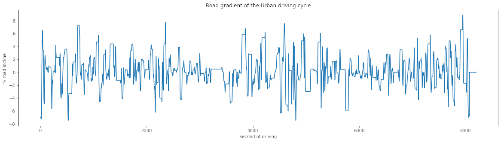

   *Figure 7: Road gradients corresponding to VECTO's urban driving cycle.*

For coach buses, VECTO’s “Intercity” driving cycle is used. This cycle has fewer stops and
less fluctuation in terms of speed levels, and it also has a higher average speed level and
lasts much longer. The first two hundred seconds of that driving cycle are depicted in :ref:`Figure 8 <figure-8>`.

.. _figure-8:

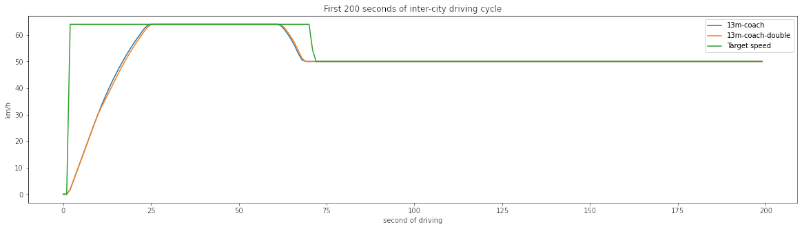

   *Figure 8: VECTO's Intercity driving cycle (first two hundred seconds).*

:ref:`Table 8 <table-8>` compares some of the parameters of both driving cycles.

.. _table-8:

.. table:: Table 8: Parameters for "Urban" and "Intercity" driving cycles
   :widths: auto
   :align: center

   +----------------------------+-----------------------+----------------+-------------------+------------------+------------------------------------+
   | Driving cycle              | Average speed [km/h]  | Distance [km]  | Driving time [s]  | Idling time [s]  | Mean positive acceleration [m.s2]  |
   +============================+=======================+================+===================+==================+====================================+
   | Midibus, 9m                | 26                    | 40             | ~7'700            | ~2'730           | 0.56                               |
   | Single deck, city bus, 13m |                       |                |                   |                  |                                    |
   | Double deck, city bus, 13m |                       |                |                   |                  |                                    |
   | Single deck, city bus, 18m |                       |                |                   |                  |                                    |
   +----------------------------+-----------------------+----------------+-------------------+------------------+------------------------------------+
   | Single deck, coach, 13m    | 57                    | 275            | ~18'000           | ~390             | 0.29                               |
   | Double deck, coach, 13m    |                       |                |                   |                  |                                    |
   +----------------------------+-----------------------+----------------+-------------------+------------------+------------------------------------+

The energy consumption model is similar to that of passenger cars: the sum of the different
resistances at the wheel is calculated, after which friction-induced losses along the drivetrain are
considered to obtain the energy required at the tank level.

VECTO’s simulations are again used to calibrate the engine and transmission efficiency of diesel
and compressed gas buses. Similar to the modeling of delivery, medium- and heavy-duty trucks,
the relation between the efficiency of the drivetrain components (i.e., engine, gearbox, and axle)
and the power load-to-peak-power ratio is used.

A calibration exercise with VECTO for the diesel-powered 13m city bus is shown in :ref:`Figure 9 <figure-9>`.
After calibration, the tank-to-wheel energy consumption value obtained from VECTO and
``carculator_bus`` for diesel-powered buses differ by less than 1 percent over the entire driving cycle.

.. _figure-9:

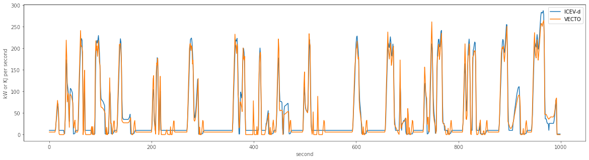

   *Figure 9: Calibration of carculator_bus energy model against VECTO simulations for a single deck 13m long diesel bus (first 1’000 seconds shown)*

Unfortunately, VECTO does not have a model for compressed gas-powered buses.
Therefore, correction factors for fuel efficiency relative to diesel buses are derived from
HBEFA 4.1 and presented in :ref:`Table 9 <table-9>`. They are calculated from the average difference in
fuel efficiency between compressed gas and diesel buses across similar traffic situations and size classes.

.. _table-9:

.. table:: Table 9: Difference in fuel economy between diesel and compressed gas urban and coach buses for similar traffic situations
   :widths: auto
   :align: center

   +----------------------------+-------------------------------------+-------------------------------------+
   | HBEFA size class           | Urban traffic situations            | Rural traffic situations            |
   +============================+=====================================+=====================================+
   | Midi < 15t                 | +10% (applicable to ” Midibus, 9m”) |                                     |
   +----------------------------+-------------------------------------+-------------------------------------+
   | 15-18t                     | +3% (relevant to “Single deck,      | +20% (relevant to “Single deck,     |
   |                            | city bus, 13m”)                     | coach, 13m”)                        |
   +----------------------------+-------------------------------------+-------------------------------------+
   | > 18t                      | +1% (relevant to “Single deck,      | +20% (relevant to “Double deck,     |
   |                            | city bus, 18m” and "Double deck,    | coach, 13m”)                        |
   |                            | city bus, 13m”                      |                                     |
   +----------------------------+-------------------------------------+-------------------------------------+

.. note::

    **Important remark:** the engine and gearbox efficiencies (and the resulting tank-to-wheel
    consumption) are calibrated against VECTO’s simulations, but the relative change in
    efficiency throughout time (i.e., along emission standards) is calibrated against HBEFA’s data.

.. _exhaust-emissions:

Exhaust emissions
*****************

As with passenger cars and trucks, several fuel-related emissions other than CO2 or SO2 are
considered. The emission factors of the HBEFA 4.1 database are used.

For buses, two sources of emissions are considered:

* Exhaust emissions: emissions from the combustion of fuel during operation. Their
  concentration relates to fuel consumption and the vehicle's emission standard.
* Non-exhaust emissions: brake, tire, and road wear emissions, as well as emissions
  of refrigerant and noise.

For exhaust emissions, factors based on the fuel consumption are derived by comparing
emission data points for different traffic situations (i.e., grams emitted per vehicle-km) in free-
flowing driving conditions, with the fuel consumption corresponding to each data point (i.e.,
MJ of fuel consumed per km), as illustrated in :ref:`Figure 10 <figure-10>` for a diesel-powered engine. The
aim is to obtain emission factors expressed as grams of a substance emitted per MJ of fuel
consumed to model emissions of buses of different sizes and mass operating on different
driving cycles.

.. note::

    **Important remark:** the degradation of anti-pollution systems for EURO-6 diesel buses (i.e.,
    catalytic converters) is accounted for, as indicated by HBEFA 4.1, by applying a degradation
    factor on the emission factors for NOx. These factors are shown in :ref:`Table 10 <table-10>` for buses with a
    mileage of 890’000 km. Since the diesel buses in this study have a kilometric lifetime of
    700’000 km, degradation factors are interpolated linearly (with a degradation factor of 1 at
    Km 0). The degradation factor corresponding to half of the vehicle kilometric lifetime is used
    to obtain a lifetime-weighted average degradation factor.

.. _table-10:

.. table:: Table 10: Degradation factors at 890'000 km for diesel buses
   :widths: auto
   :align: center

   +--------------------------------------+---------+
   | **Degradation factor at 890’000 km** | \       |
   +======================================+=========+
   |\                                     | **NOx** |
   +--------------------------------------+---------+
   | **EURO-6**                           | 1.3     |
   +--------------------------------------+---------+

.. _figure-10:

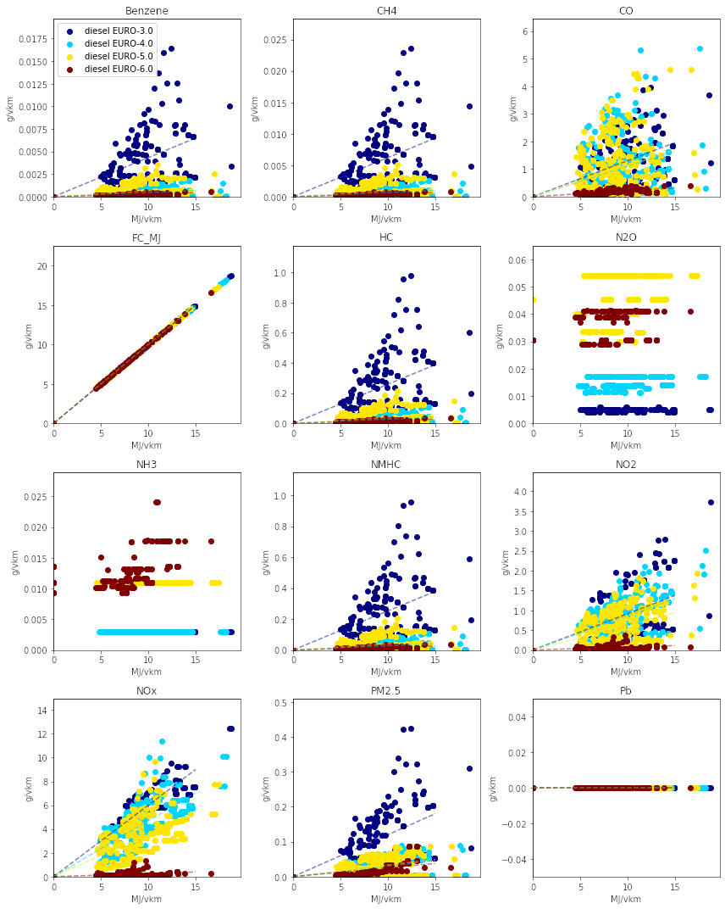

   *Figure 10: Relation between emission factors and fuel consumption for a diesel-powered urban bus for several “urban” traffic situations*

Using these fuel-based emissions factors, emissions for each second of the driving cycle for each substance are calculated.

To confirm that such approach does not yield kilometric emissions too different from the
emission factors per vehicle-kilometer proposed by HBEFA 4.1, :ref:`Figure 11 <figure-11>` compares the
emissions obtained by ``carculator_bus`` using VECTO’s “Urban” driving cycle over one
vehicle-km (red dots) for the “Single deck, city bus, 13m” with the distribution of the emission
factors across different “urban” traffic situations (green box-and-whiskers) as well as the
traffic-situation-weighted average emission factors (yellow dots) given by HBEFA 4.1 for
various emission standards for a bus with a gross mass of 15-18 tons.

There is some variation across HBEFA’s urban traffic situations. Still, the emissions obtained
remain, for most substances, within 50% of the distributed HBEFA values across traffic
situations, except for N2O and NOx, which are slightly under and overestimated, respectively.
Those two substances are also underestimated compared to the traffic situation-weighted
average emission factors given by HBEFA 4.1, especially for early emission standards.
These deviations can be explained by a different underlying driving cycle to calculate fuel
consumption and related emissions. The comparison between the model’s emission results
for the intercity driving cycle using coach buses and HBEFA’s emission factors for “rural”
traffic situations shows a similar picture.

.. _figure-11:

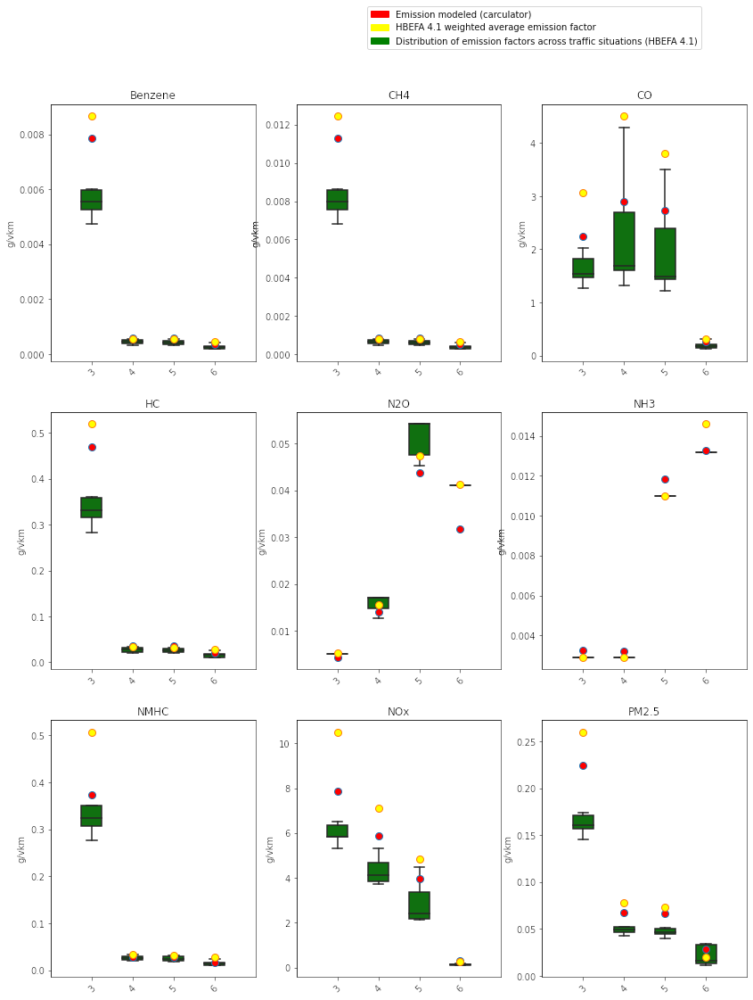

   *Figure 11: Validation of the exhaust emissions model with the emission factors provided by HBEFA 4.1 for urban buses in traffic situations of “urban” type.*

.. note::

    Box-and-whiskers: distribution of HBEFA’s emission factors for different “urban” traffic situations (box: 50% of
    the distribution, whiskers: 90%). Yellow dots: traffic situation-weighted average emission factor given by
    HBEFA 4.1. Red dots: modeled emissions calculated by ``carculator_bus`` with the “Urban” driving cycle for
    a 13m single deck urban bus, using the relation between fuel consumption and amounts emitted.

.. _modelling-approach-applicable-to-electric-vehicles:

Modelling approach applicable to electric vehicles
--------------------------------------------------

City bus itinerary parameters
*****************************

For electric buses, a few parameters affect their charging strategy and the sizing of the
battery, and they are crucial to detail.

The second edition of the ZeEUS eBus project report :cite:`ct-1036` extracts
statistics on routes serviced by electric city buses in Europe, presented in :ref:`Table 11 <table-11>`. It is
found that motion-charging buses are operated significantly longer than depot- and
opportunity-charging buses per shift (a shift is understood as the operation time between two
deep charges at the bus depot). It is also found that opportunity-charging buses are
operated over a slightly longer distance than depot-charging buses, although not to a
significant extent. Based on the average distance driven per shift, the average operation
time for each electric bus type is calculated. Because the resulting values for opportunity-
and depot-charging buses are very close (i.e., 6.5 hours against 6 hours), a similar operation
time of 6 hours is assumed. All these parameters are presented in :ref:`Table 12 <table-12>`.

.. _table-11:

.. table:: Table 11: Statistics on electric bus routes in Europe
   :widths: auto
   :align: center

   +---------------------------+-----------------+-----------------+-----------------+-----------------+-----------------+
   |                           | **BEV-opp**     | **BEV-depot**   | **BEV-motion**  | **Source**      | **Comment**     |
   +===========================+=================+=================+=================+=================+=================+
   | Route count               | 23              | 31              | 12              | :cite:`ct-1036` |                 |
   +---------------------------+-----------------+-----------------+-----------------+-----------------+-----------------+
   | Average distance driven   | 170             | 156             | 310             |                 |                 |
   | per shift [km]            |                 |                 |                 |                 |                 |
   +---------------------------+-----------------+-----------------+-----------------+-----------------+-----------------+
   | Average operation time per| 6               | 6               | 12              |                 | Calculated based|
   | shift (in motion) [h]     |                 |                 |                 |                 | on the average  |
   |                           |                 |                 |                 |                 | speed of VECTO’s|
   |                           |                 |                 |                 |                 | driving cycle   |
   |                           |                 |                 |                 |                 | for city buses. |
   +---------------------------+-----------------+-----------------+-----------------+-----------------+-----------------+

For coach buses, it is assumed they drive 9 hours per day (corresponding to the limit set by
the EU and Swiss legislation if only one driver is present).

Finally, using a pantograph system, opportunity-charging electric buses (BEV-opp) can
charge once per trip. In-motion-charging electric trolleybuses (BEV-motion) follow an
itinerary where 40% to 70% of the trip distance is equipped with overhead electrical lines to
allow for charging, based on :cite:`ct-1069` but also based on
the battery capacity featured on current models on the market.

.. _table-12:

.. csv-table:: Table 12: Use-related parameters for the different electric buses
    :file: _static/tables/table_2.csv
    :widths: auto
    :align: center
    :header-rows: 1

.. _traction-energy-2:

Traction energy
***************

Electric vehicles
~~~~~~~~~~~~~~~~~

VECTO does not have a model for battery or fuel-cell electric buses. Therefore, constant
efficiency values for the engine and drivetrain for electric buses in driving and recuperation
mode from :cite:`ct-1080` are used. They are detailed in :ref:`Table 13 <table-13>` and :ref:`Table 14 <table-14>`.

.. _table-13:

.. table:: Table 13: Efficiency values along the drivetrain of electric buses in driving mode
   :widths: auto
   :align: center

   +---------------------+-----------------+-------------+---------------+
   | **Eff. of**         | **Fuel cell**   | **BEV bus** | **Trolleybus**|
   | **subsystem**       | **bus**         |             |               |
   +=====================+=================+=============+===============+
   | Fuel tank           | 0.98            |             |               |
   +---------------------+-----------------+-------------+---------------+
   | Energy storage      |                 | 0.92        |               |
   +---------------------+-----------------+-------------+---------------+
   | Fuel cell stack     | 0.55            |             |               |
   +---------------------+-----------------+-------------+---------------+
   | Converter           |                 | 0.98        |               |
   +---------------------+-----------------+-------------+---------------+
   | Rectifier           |                 |             |               |
   +---------------------+-----------------+-------------+---------------+
   | Inverter            | 0.98            | 0.98        | 0.98          |
   +---------------------+-----------------+-------------+---------------+
   | Electric motor      | 0.93            | 0.93        | 0.93          |
   +---------------------+-----------------+-------------+---------------+
   | Reduction gear      | 0.95            | 0.95        | 0.95          |
   +---------------------+-----------------+-------------+---------------+
   | Drive axle          | 0.94            | 0.94        | 0.94          |
   +---------------------+-----------------+-------------+---------------+
   | Total               | 0.44            | 0.73        | 0.81          |
   +---------------------+-----------------+-------------+---------------+

|br|

.. _table-14:

.. table:: Table 14: Efficiency values along the drivetrain of electric buses in recuperation mode
   :widths: auto
   :align: center

   +---------------------+-----------------+-------------+---------------+
   | **Eff. of**         | **Fuel cell**   | **BEV bus** | **BEV-motion**|
   | **subsystem**       | **bus**         |             |               |
   +=====================+=================+=============+===============+
   | Drive axle          | 0.94            | 0.94        |    0.94       |
   +---------------------+-----------------+-------------+---------------+
   | Reduction gear      | 0.95            | 0.95        |    0.95       |
   +---------------------+-----------------+-------------+---------------+
   | Electric motor      | 0.93            | 0.93        |    0.93       |
   +---------------------+-----------------+-------------+---------------+
   | Rectifier           | 0.98            | 0.98        |    0.98       |
   +---------------------+-----------------+-------------+---------------+
   | Converter           | 0.98            | 0.98        |               |
   +---------------------+-----------------+-------------+---------------+
   | Energy storage      | 0.85            | 0.85        |    0.85       |
   +---------------------+-----------------+-------------+---------------+
   | Converter           | 0.98            | 0.98        |               |
   +---------------------+-----------------+-------------+---------------+
   | Inverter            | 0.98            | 0.98        |    0.98       |
   +---------------------+-----------------+-------------+---------------+
   | Electric motor      | 0.93            | 0.93        |    0.93       |
   +---------------------+-----------------+-------------+---------------+
   | Reduction gear      | 0.95            | 0.95        |    0.95       |
   +---------------------+-----------------+-------------+---------------+
   | Drive axle          | 0.94            | 0.94        |    0.94       |
   +---------------------+-----------------+-------------+---------------+
   | Total               | 0.54            | 0.54        |    0.56       |
   +---------------------+-----------------+-------------+---------------+

Energy Storage
**************

Battery electric buses
~~~~~~~~~~~~~~~~~~~~~~

The sizing of the energy storage unit for battery electric buses is sensitive to a few parameters,
such as the operation time per shift, the number of charging opportunities per trip, the share of
the bus line length equipped with overhead lines, and of course, the specific energy density of
the battery cells and the amplitude of charge cycles. Furthermore, a 20% margin on the battery
capacity is added for emergency or unexpected use.

.. note::

    * **Important remark:** ``carculator_bus`` models all buses. However, suppose a battery electric vehicle
      (or other) has an energy storage unit mass leading to a fully occupied driving mass superior to
      the maximum allowed gross mass. In that case, it will not be processed for LCI quantification,
      which is typically the case for battery electric coach buses.
    * **Important remark:** overnight charging vehicles (BEV-depot) use a Li-NMC battery by default
      (but inventories with an NCA and LFP battery are also considered), while opportunity- (BEV-opp)
      and in motion-charging (BEV-motion) vehicles use a Li-LTO battery. According to :cite:`ct-1034`
      Li-LTO batteries are better suited for general ultra-fast charging and under extreme
      temperatures in particular. This is also confirmed by recent trends, although some models
      designed for ultra-fast charging can use Li-NMC and Li-LFP batteries.
    * **Important remark:** According to :cite:`ct-1112`, Li-LFP batteries equip electric buses in Europe,
      but the vast majority are used in Asia, China in particular. 95% of the battery electric buses in
      China are equipped with Li-LFP batteries. Outside of China, it is 47% only. Sill according to
      :cite:`ct-1112`, the European market seems to favor depot-charging buses with large Li-NMC batteries
      over opportunity- or motion-charging buses. In 2018, China accounted for 98% of the new
      battery-electric buses registered globally.

The expected battery lifetime (and the need for replacement) is based on the expected battery
cycle life, based on theoretical values given by :cite:`ct-1034` as well as some
experimental ones from :cite:`ct-1063`. Although the specifications of the different battery
chemistry are presented in :ref:`Table 15 <table-15>`

.. _table-15:

.. table:: Table 15: Parameters for different battery chemistry for battery electric buses
   :widths: auto
   :align: center

   +-------------------------------------+------------+----------+-----------------+-------------+---------------+
   |                                     | unit       | LFP      | LTO             | NMC         | NCA           |
   +=====================================+============+==========+=================+=============+===============+
   | Cell voltage                        | V          | 3.2      | 2.3             | 3.6         | 3.6           |
   +-------------------------------------+------------+----------+-----------------+-------------+---------------+
   | Cell capacity                       | Ah         | 1.4-4.5  | 2.0-6.5         | 3.7-5.3     | 4.8           |
   +-------------------------------------+------------+----------+-----------------+-------------+---------------+
   | Energy density                      | Wh/kg cell | 115-146  | 76-77           | 175-200     | 200-230       |
   +-------------------------------------+------------+----------+-----------------+-------------+---------------+
   | Charge rate                         |            | 1C       | 4C-10C          | 2C-3C       | 2C-3C         |
   +-------------------------------------+------------+----------+-----------------+-------------+---------------+
   | Cycle life (at 100% DoD)            | unit       | 7'000+   | 5'000-7'000     | 2'000       | 1'000         |
   +-------------------------------------+------------+----------+-----------------+-------------+---------------+
   | Corrected cycle life                | unit       | 7'000    | 7'000           | 3'000       | 1'500         |
   +-------------------------------------+------------+----------+-----------------+-------------+---------------+

Given the vehicle's energy consumption and the required battery capacity, ``carculator_bus``
calculates the number of charging cycles needed and the resulting number of battery
replacements, given the chemistry-specific cycle life of the battery. As discussed at the beginning
of this report, the expected cycle life is corrected.

Considering the chemistry-specific cycle life values, there is a difference in the extent battery cell
degrades over charging cycles. It is explained by the fact that Li-LTO batteries are charged with
a smaller charge cycle amplitude (about 40-50%, against 80% for Li-NMC batteries). This also
leads to an important sizing factor. The Li-NMC battery of the BEV-depot bus needs replacing
multiple times during the vehicle's lifetime, while the Li-LTO battery of ultra-fast charging buses
only requires one replacement. The number of replacements is even higher when using Li-NCA
batteries, as the expected cycle life is comparatively lower.

:ref:`Table 16 <table-16>` shows the battery sizing factors considered.

.. _table-16:

.. table:: Table 16: Sizing factors used for different battery chemistries
   :widths: auto
   :align: center

   +-----------------------------------+----------------------------+--------------------------------+
   |                                   | **Ultra-fast charging**    | **Fast-charging (plug-in**     |
   |                                   | **(pantograph, induction,**| **station)**                   |
   |                                   | **overhead wires)**        |                                |
   +===================================+============================+================================+
   | **Battery chemistries**           | **LTO**                    | **NMC, NCA, LFP**              |
   +-----------------------------------+----------------------------+--------------------------------+
   | Maximum SoC                       | 90%                        | 100%                           |
   +-----------------------------------+----------------------------+--------------------------------+
   | Maximum DoD                       | 40%                        | 20%                            |
   +-----------------------------------+----------------------------+--------------------------------+
   | Sizing factor                     | 2                          | 1.25                           |
   +-----------------------------------+----------------------------+--------------------------------+
   | Additional margin in capacity     | +20%                       | +20%                           |
   +-----------------------------------+----------------------------+--------------------------------+

The effect of switching the battery chemistry for each type of electric bus can be quantified,
as :ref:`Figure 12 <figure-12>` illustrates. While Li-LFP and Li-LTO batteries lead to fewer replacements, they
are also heavier and result in higher energy consumption – and the necessity to increase the
battery storage capacity consequently.

.. _figure-12:

.. figure:: _static/img/image_18.png
   :align: center

   *Figure 12: Effect of battery chemistry on the number of replacements, battery capacity, and mass for a 13m long single deck city bus.*

:ref:`Table 17 <table-17>` indicates the number of battery replacements considered for each type of battery chemistry.

.. _table-17:

.. table:: Table 17: Lifetime battery replacements for different battery chemistries
   :widths: auto
   :align: center

   +---------------------------------------------+------+------+------+------+
   |                                             | NMC  | LFP  | NCA  | LTO  |
   +=============================================+======+======+======+======+
   | Bus, opportunity charging                   |      |      |      | 1    |
   +---------------------------------------------+------+------+------+------+
   | Bus, motion charging                        |      |      |      | 1    |
   +---------------------------------------------+------+------+------+------+
   | Bus, depot charging                         | 1    | 1    | 2    |      |
   +---------------------------------------------+------+------+------+------+

Fuel cell electric buses
~~~~~~~~~~~~~~~~~~~~~~~~

The energy storage unit of fuel cell electric buses is sized based on the required amount of
hydrogen onboard (i.e., defined by the required range autonomy). The relation between
hydrogen and tank mass is derived from manufacturers’ specifications – mainly from :cite:`ct-1042, ct-1067`,
as shown in :ref:`Figure 13 <figure-13>`.

We start from the basis that fuel cell electric buses are equipped with 650 liters cylinders,
which contain 14.4 kg hydrogen at 700 bar, for an (empty) mass of 178 kg. The required size
and mass of the tank eventually depend on the number of hours of service but should not
exceed 300 kg, excluding the hydrogen.

The hydrogen tank is of type IV, a carbon fiber-resin (CF) composite-wrapped single tank
system, with an aluminum liner capable of storing 5.6 kg usable hydrogen, weighting 119 kg
per unit (of which 20 kg is carbon fiber), which has been scaled up to 178 kg for a storage
capacity of 14.4 kg to reflect current models on the market :cite:`ct-1067`. The inventories
are initially from :cite:`ct-1042`. The inventories for the carbon fiber supply are from
:cite:`ct-1008`. Note that alternative hydrogen tank designs exist, using substantially
more carbon fiber (up to 70% by mass): this can potentially impact results as carbon fiber is
very energy-intensive to produce.

.. _figure-13:

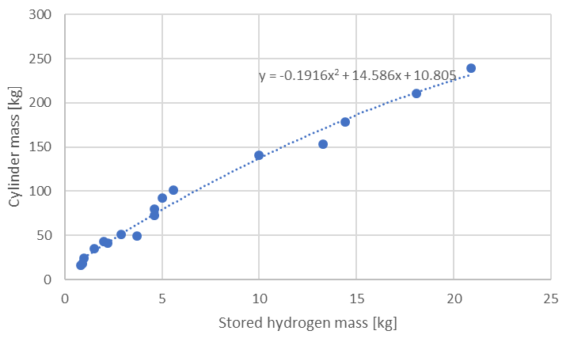

   *Figure 13: Relation between stored hydrogen mass and hydrogen storage cylinder mass.*

Inventories for Type IV hydrogen tanks from :cite:`ct-1008` are used to that effect.

.. note::

    **Important remark:** a battery is also added to fuel cell electric buses. Based on the
    manufacturer’s specification, its storage capacity represents approximately 9% of the
    storage capacity of the hydrogen cylinders, with a minimum capacity of 20 kWh.

Compressed gas buses
~~~~~~~~~~~~~~~~~~~~
For compressed gas buses, the energy storage is in a four-cylinder configuration, with each
cylinder containing up to 57.6 kg of compressed gas – 320 liters at 200 bar.

The relation between the compressed gas and the cylinder mass is depicted in :ref:`Figure 14 <figure-14>`.
This relation is based on manufacturers’ data – mainly from :cite:`ct-1017, ct-1066`.

.. _figure-14:

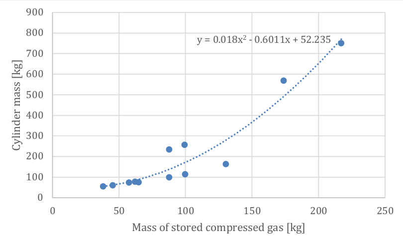

   *Figure 14: Relation between the mass of stored compressed gas and cylinder mass.*

Inventories for a Type II 200-bar compressed gas tank with a steel liner are from :cite:`ct-1010`.

Charging stations
*****************
The parameters for the different charging stations modeled are presented in :ref:`Table 18 <table-18>`.

.. _table-18:

.. csv-table:: Table 18: Parameters of the different charging stations for battery electric buses
    :file: _static/tables/table_3.csv
    :widths: auto
    :align: center
    :header-rows: 1

Finding solutions and validation
--------------------------------
Very much like ``carculator`` and ``carculator_truck``, ``carculator_bus`` iterates until:

* the change in curb mass of the vehicles between two iterations is below 1%

All while considering the **following constraints**:

* For **all buses**, the driving mass when fully occupied cannot be superior to the gross
  mass of the vehicle (this is specifically relevant for BEV buses)
* For all buses, but particularly relevant for electric buses, the curb mass should be so
  low as to allow a 50% increase in the average number of passengers (i.e., during
  peak hours), all while staying under the permissible gross weight limit.
* **Coach buses** cannot be considered for opportunity and in-motion charging strategies.
* For **BEV-depot** buses, the capacity of the battery must be so that it gives enough
  time to charge it overnight to be ready for the next shift.

Validation
----------

Manufacturer’s specifications
*****************************

The bus models generated by ``carculator_bus`` are validated against the specifications found
in the literature and manufacturers’ data – available in :ref:`Annex C <annex_c>` of this report. For electric
buses, most of the specifications obtained (i.e., battery capacity, motor power, curb mass)
are from the ZeEUS project report :ref:`ct-1036`.

.. note:: **Important remark**: the sample size for fuel cell electric buses is very low (i.e., n=2).

The model returns curb masses and engine and electric motor power output values that
largely agree with current European models, as shown in
:ref:`Figure 15 <figure-15>` and :ref:`Figure 16 <figure-16>` respectively.

.. _figure-15:

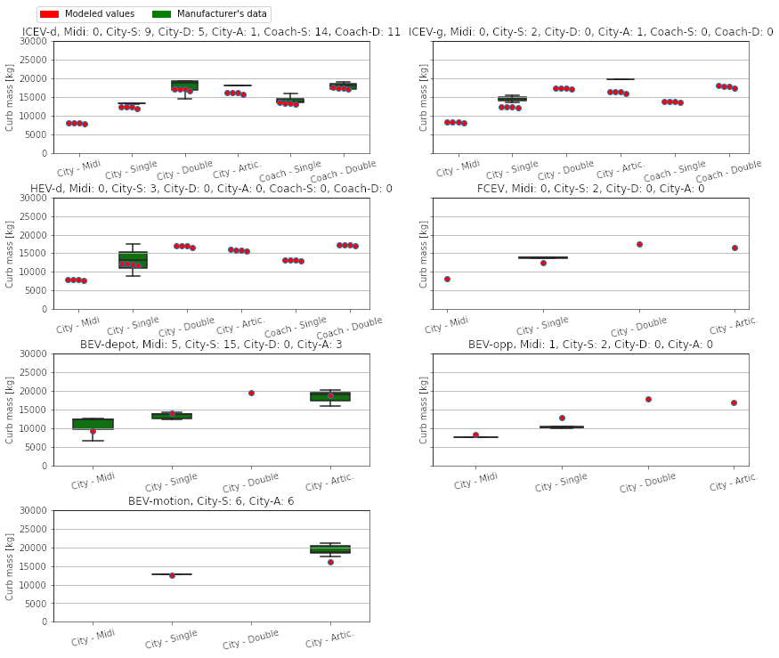

   *Figure 15: Validation of the vehicles' curb mass against manufacturers' data. Above each plot, the sample size is indicated for each size class.*

.. _figure-16:

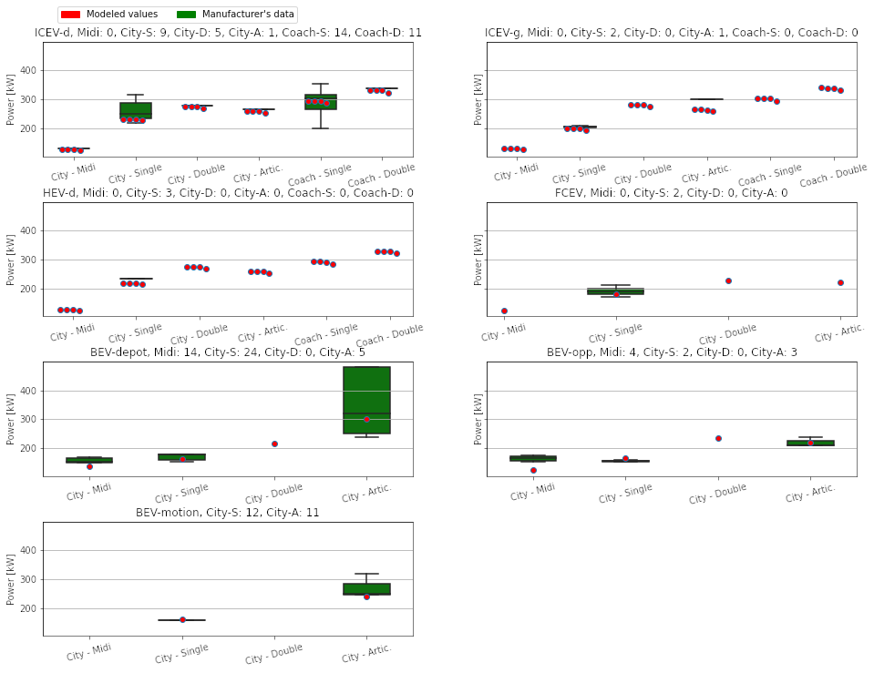

   *Figure 16: Validation of the vehicles' engine power against manufacturers' data. Above each plot, the sample size is indicated for each size class.*

The comparison between the modeled battery energy storage capacity for battery electric
buses and what is currently found on the market in Europe is shown in :ref:`Figure 17 <figure-17>`.
For BEV-depot buses, the model returns a battery capacity significantly higher than the median for
European buses: based on personal communication with INFRAS, there is a tendency in
Switzerland to purchase depot-charging electric buses with a battery capacity higher than
average. It is, for example, the case with MAN’s Lion’s City electric bus models, which
feature a 480 kWh and 640 kWh battery for the 12-meter and 18-meter versions,
respectively. This overestimate is an attempt to reflect that trend partially.

.. _figure-17:

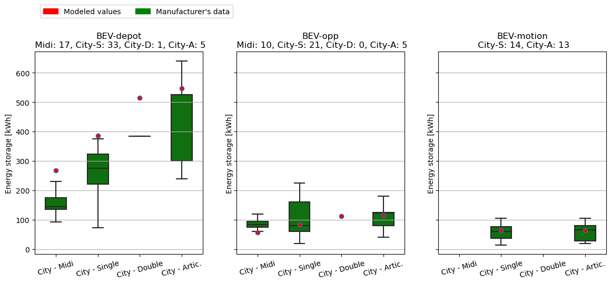

   *Figure 17: Validation of the energy storage capacity of the battery electric buses against manufacturers' data. Above each plot, the sample size is indicated for each size class.*

The resulting curb mass for each bus model is within the range given by the different models
operated in Europe, as shown in :ref:`Figure 18 <figure-18>`.

.. _figure-18:

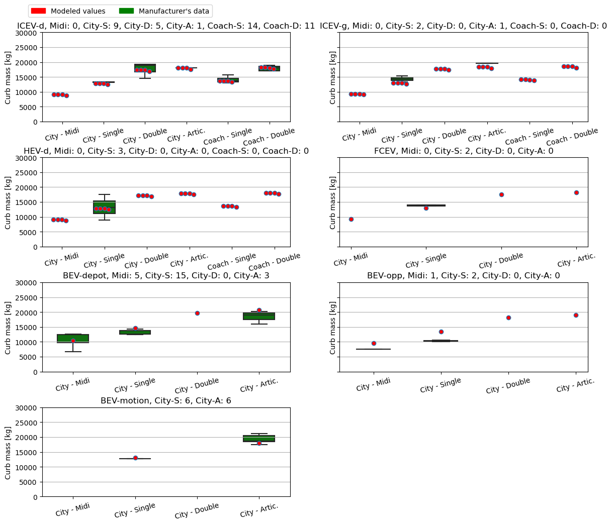

   *Figure 18: Validation of the vehicles' curb mass against manufacturers' data. Above each plot, the sample size is indicated for each size class.*

HEBFA’s data
************

:ref:`Figure 19 <figure-19>` compares the tank-to-wheel energy consumption modeled for urban buses with
the values obtained from HBEFA 4.1 for urban traffic situations. HBEFA’s size class “Midi <=
15t” corresponds in this case to “Midibus, 9m”, “<= 18t” and “15-18t” to “Single deck, city
bus, 13m”, and “>18t” to “Single deck, city bus, 18m”. Overall, carculator_bus provides
slightly higher energy consumption numbers for diesel and compressed gas city buses than
those collected from HBEFA 4.1. This could be explained by the driving cycle from VECTO
being more demanding in accelerations and stops.

.. _figure-19:

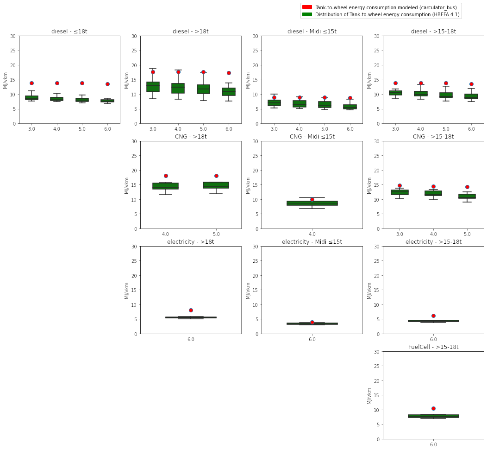

   *Figure 19: Compares modeled tank-to-wheel energy consumption for city buses and values reported from HBEFA 4.1 for urban traffic situations. X-axis labels correspond to the European emission standard (except for electric powertrains).*

:ref:`Figure 20 <figure-20>` compares the tank-to-wheel energy consumption modeled for coach buses with
the values reported from HBEFA 4.1 for rural traffic situations. HBEFA’s size “<= 18t” and
“15-18t” are matched with “Single deck, coach bus, 13m” and “>18t” to “Double deck, coach
bus, 13m”. There is a good agreement between the energy consumption values for coach
buses modeled by carculator_bus and those from HBEFA 4.1.

.. _figure-20:

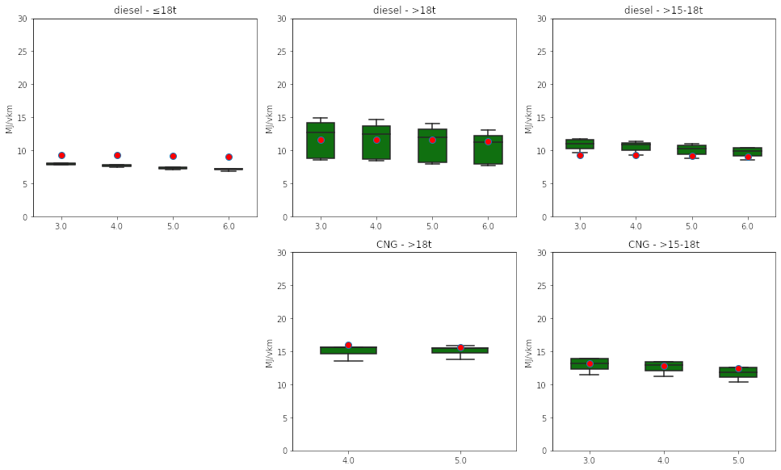

   *Figure 20: Compares modeled tank-to-wheel energy consumption for coach buses and values reported from HBEFA 4.1 for rural traffic situations. X-axis labels correspond to the European emission standard.*

